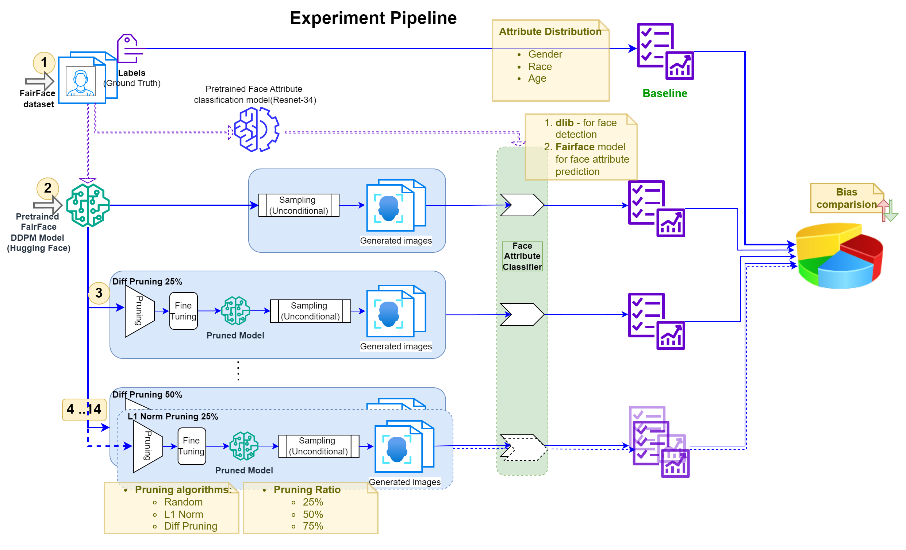
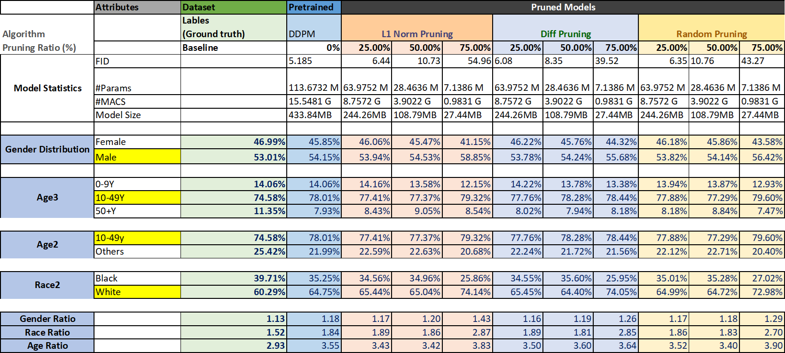

# Bias in Pruned Diffusion Models
## An Analysis of the Impact of Pruning on Gender, Racial, and Age Bias

### Capstone Project 2 (CS6705) by Satyabrat Kumar Gupta (CS21MDS14014) & Ashutosh Patel (CS21MDS14031)
Guided by : Prof. Dr. Vineeth N Balasubramanian

RA		: Deepak Mittal, Akshay Shilhora

## Introduction
- Overview of the Project:
   1. Study of impact of pruning on bias in diffusion models
   2. Focus on different pruning algorithm and their impact on gender, racial, and age biases.

- Purpose and Objectives:
   1. To analyze how pruning affects bias in diffusion models.
      - Investigate ‘Introduction of Bias’
      - Quantify Bias Changes
      - Feature Analysis
      - Performance vs. Fairness Trade-offs

   2. To compare different pruning algorithms in terms of their impact on bias.
      - Algorithm Evaluation:
      - Fairness Analysis
      - Optimal Pruning Strategy

## Methodology

- Bias Study Aspects:
   1. Effect of sparsity on bias in diffusion models
      - Pruning Ratio: 25% / 50% / 75%

   2. Effect of pruning approaches on bias in diffusion models
      - Diff Pruning vs L1 Norm Pruning vs Random Pruning

### Experiment Pipeline

</img>

## Results

</img>

## Summary

   - Performance Degradation: Pruning, especially at higher levels, degrades model performance as indicated by increasing FID scores.
   - Model Efficiency: Significant reductions in model size, parameters, and MACs are achieved with pruning, beneficial for deployment on resource-constrained devices.
   - Bias Shifts: Pruning introduces shifts in gender, age, and race predictions, with a tendency towards predicting more males, whites, and 10-49Y age group as pruning increases.
   - Best Pruning Level: 25% pruning generally maintains a balance between efficiency gains and performance degradation, with acceptable FID scores and smaller shifts in bias compared to higher pruning levels.

   Future research could explore other types of biases, additional pruning methods, and fairness-aware pruning strategies inspired by recent papers that selectively remove model parameters while preserving fairness in predictions.

## References
   - Analyzing Bias in Diffusion-based Face Generation Models
   - DepGraph: Towards Any Structural Pruning
   - Structural Pruning for Diffusion Models
   - Uncovering Bias In Face Generation Models
   - FairFace: Face Attribute Dataset for Balanced Race, Gender, and Age
   - Fairness-Aware Structured Pruning in Transformers

## Acknowledgement
This project is heavily based on [Diff-Pruning](https://github.com/VainF/Diff-Pruning), [FairFace](https://github.com/dchen236/FairFace), [Diffusers](https://github.com/huggingface/diffusers), [Torch-Pruning](https://github.com/VainF/Torch-Pruning), [pytorch-fid](https://github.com/mseitzer/pytorch-fid). Our experiments were conducted on [ddim](https://github.com/ermongroup/ddim) and [FairFace](https://github.com/dchen236/FairFace).
